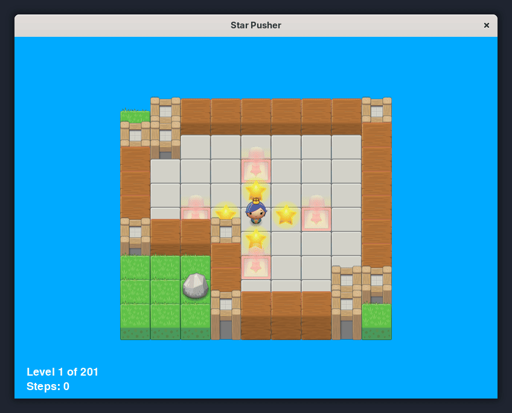

# Starpusher

Add a feature to display a "Level Complete" message for 3 seconds when the player completes a level before transitioning to the next one.

The game already has a "Level Complete" screen which requires pressing a key to go to the next level. I added a small delay after pressing they key instead.

